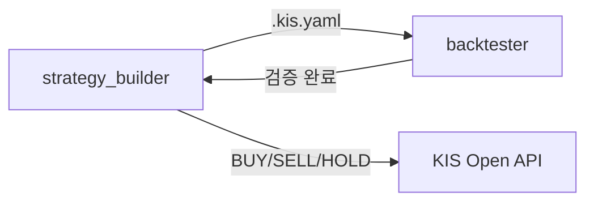

# KIS 매수신호 알림 시스템

한국투자증권(KIS) Open API로 시세를 수집해 **MDD 단계 + 일/주/월 RSI·MFI·다이버전스**로
매수 후보를 스코어링하고, 매일 자동으로 텔레그램 알림과 대시보드를 발행하는 개인용
시스템입니다. **조회·알림만 하며 실제 매수/매도 주문은 하지 않습니다** — 알림을 받으면
MTS 앱에서 직접 수동으로 매매합니다.

## 무엇을 하는가

매일 GitHub Actions가 아래 순서로 `main.py`(→ `signal_bot/pipeline.py`)를 실행합니다.

1. `signal_bot/fetch_universe.py` — 관심 종목의 최신 일봉 조회
2. `signal_bot/baseline_fetch.py` — 20년치 MDD 계산용 베이스라인 갱신(보통 이미 최신이라 생략)
3. `signal_bot/pipeline.py` — MDD 단계 판정 + 일/주/월봉 RSI·MFI·다이버전스 계산,
   결과를 `signal_bot/data/history.json`에 누적 저장하고 `signal_bot/alerts.py`로
   텔레그램 알림 발송
4. `signal_bot/export_dashboard.py` — 화면 표시에 필요한 필드만(종목코드·MDD상태·
   RSI/MFI/다이버전스·현재가·타임스탬프) 골라 `docs/scores.json` + `docs/detail/*.json`
   생성 — **API 키·계좌정보는 절대 포함하지 않습니다.**

## 라이브 대시보드

[`docs/index.html`](docs/index.html)이 GitHub Pages로 공개돼 있으며, 위 3번 단계가 매일
새로 발행하는 `scores.json`/`detail/*.json`만 읽어 그립니다.

## 다른 저장소와의 관계

이 저장소는 [`withgest-lab/portfolio-retirement-dashboard`](https://github.com/withgest-lab/portfolio-retirement-dashboard)의
"KIS 매수신호" 탭이 매일 배포 시점에 가져다 쓰는 데이터 원본입니다. 두 저장소는
API 키·시크릿을 전혀 공유하지 않는 완전히 독립적인 저장소이며, 이 저장소에서
`docs/`를 고치면 다음 날 자동으로 그쪽 화면에도 반영됩니다.

## 자동 실행

[`.github/workflows/daily.yml`](.github/workflows/daily.yml)이 매일 KST 07:30(UTC 22:30)에
실행됩니다. KIS 앱키/앱시크릿/계좌번호는 코드에 있지 않고 **GitHub Secrets**
(`KIS_APP_KEY`, `KIS_APP_SECRET`, `KIS_ACCT_NO`)로 주입해 `~/KIS/config/kis_devlp.yaml`을
그때그때 생성합니다. `workflow_dispatch`로 수동 실행도 가능합니다.

## AI 트레이딩 도구 (직접 구축)

샘플 코드 실행 외에, 전략 설계 → 백테스팅 파이프라인도 직접 구축해 사용 중입니다.



| 디렉토리 | 역할 | 상세 |
|----------|------|------|
| `strategy_builder/` | 전략 설계 + 시그널 생성 | 80개 기술지표, 10개 프리셋 전략, BUY/SELL/HOLD 신호 ([README](strategy_builder/README.md)) |
| `backtester/` | 과거 검증 + 파라미터 최적화 | Docker 기반 QuantConnect Lean, HTML 리포트 ([README](backtester/README.md)) |
| `MCP/` | AI 도구 연결 | KIS Code Assistant + Trading MCP ([README](MCP/README.MD)) |

`strategy_builder`에서 설계한 전략을 `.kis.yaml`로 내보내면 `backtester`에서 그대로
Import해 백테스트할 수 있습니다. 포맷 상세는 각 디렉토리 README를 참고하세요.

## 개발 환경 설정 (KIS API 인증)

`signal_bot`과 아래 부록의 샘플코드 모두 한국투자증권 Open API 인증이 필요합니다.

### Python 환경

- Python 3.11 이상, **uv** 패키지 매니저 권장

```bash
# uv 설치
powershell -c "irm https://astral.sh/uv/install.ps1 | iex"   # Windows
curl -LsSf https://astral.sh/uv/install.sh | sh                # macOS/Linux

# 의존성 설치
uv sync
```

### KIS Open API 신청 및 설정

🍀 [서비스 신청 안내](https://apiportal.koreainvestment.com/about-howto)
1. 한국투자증권 계좌 개설 및 ID 연결
2. 홈페이지/앱에서 Open API 서비스 신청 → 앱키(App Key)·앱시크릿(App Secret) 발급
3. 모의투자·실전투자 앱키를 각각 준비

로컬에서 돌릴 때는 프로젝트 루트의 `kis_devlp.yaml`을 `~/KIS/config/`로 복사한 뒤
본인의 앱키/앱시크릿/HTS ID/계좌번호로 수정합니다(자동 실행 시에는 위 "자동 실행"
절처럼 GitHub Secrets가 이 파일을 대신 생성합니다).

```bash
mkdir -p ~/KIS/config
cp kis_devlp.yaml ~/KIS/config/
```

```yaml
my_app: "여기에 실전투자 앱키 입력"
my_sec: "여기에 실전투자 앱시크릿 입력"
my_htsid: "사용자 HTS ID"
my_acct_stock: "증권계좌 8자리"
my_prod: "01" # 종합계좌
```

### 문제 해결

- **토큰 오류**: `ka.auth(svr="prod")` 또는 `svr="vps"`로 재발급(1분당 1회)
- **설정 파일 오류**: `kis_devlp.yaml`의 앱키/앱시크릿/계좌번호/HTS ID 형식 확인
- **의존성 오류**: `uv sync --reinstall`
- **Docker 오류(backtester)**: `docker info`, `docker images | grep lean`
- **초당 거래건수 초과(`EGW00201`)**: 모의투자 계좌는 REST 호출 제한이 낮음 — 연속 호출이
  많은 작업(파라미터 최적화 등)은 실전투자 계좌 권장

## 부록 — KIS Open API 샘플코드

`examples_llm/`, `examples_user/`는 한국투자증권이 공식 배포하는
[`koreainvestment/open-trading-api`](https://github.com/koreainvestment/open-trading-api)
샘플코드를 그대로 들여온 것으로, `signal_bot/kis_client.py`가 `examples_llm/kis_auth.py`를
실제로 임포트해 인증에 사용하는 **런타임 의존성**입니다.

- `examples_llm/`: LLM이 단일 API 기능을 탐색·호출하기 쉽도록 기능 단위로 쪼갠 샘플
  (한줄 호출 파일 `[함수명].py` + 검증 파일 `chk_[함수명].py`)
- `examples_user/`: 국내/해외 주식·채권·선물옵션·ELW·ETF 등 상품별로 통합된 실전 예제
  (`[카테고리]_functions.py` + `[카테고리]_examples.py`, REST/Websocket 모두 지원)
- `kis_auth.py`: 토큰 발급·API 호출 공통 함수, 실전/모의투자 환경 전환

원본 저장소가 지속적으로 갱신되는 만큼, 전체 API 카테고리·사용법은 원본
[`koreainvestment/open-trading-api`](https://github.com/koreainvestment/open-trading-api)
README를 참고하세요. LLM 에이전트용 목차는 [`llms.txt`](./llms.txt)에 있습니다.

## 보안 메모

- KIS 앱키/앱시크릿/계좌번호/텔레그램 봇 토큰은 GitHub Secrets에만 존재하며 코드에
  하드코딩돼 있지 않습니다.
- `docs/scores.json`·`docs/detail/*.json`(공개 대시보드 데이터)에는 화면 표시용 필드만
  들어가고 계좌·인증 정보는 절대 포함되지 않습니다(`signal_bot/export_dashboard.py`).
- `.gitignore`가 `KIS/`, `.master/`, `.kis_token*.json`, `kis_devlp.yaml`(루트 템플릿
  제외 시)류의 실제 인증 파일을 커밋 대상에서 제외합니다.

---

# 📧 문의사항

- [💬 한국투자증권 Open API 챗봇](https://chatgpt.com/g/g-68b920ee7afc8191858d3dc05d429571-hangugtujajeunggweon-open-api-seobiseu-gpts)에 언제든 궁금한 점을 물어보세요.
